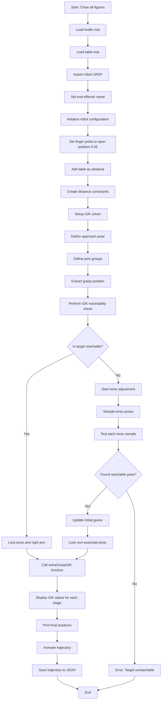
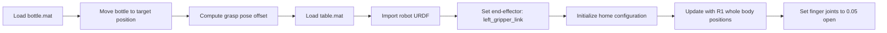
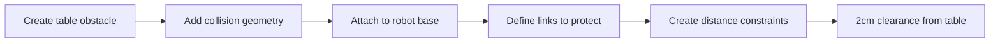
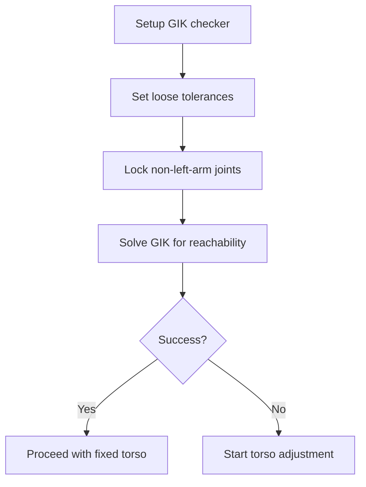
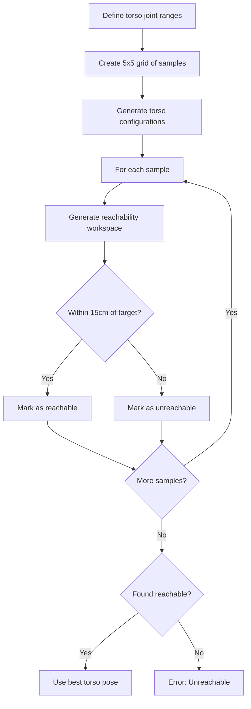
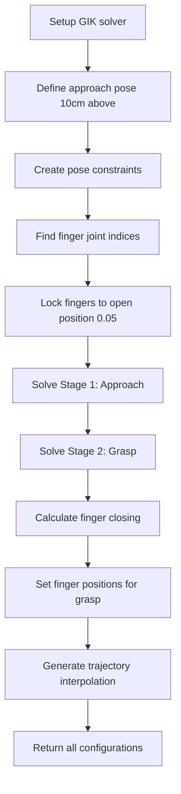
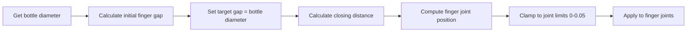
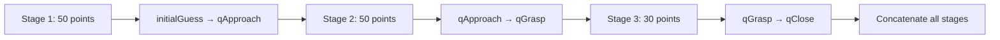
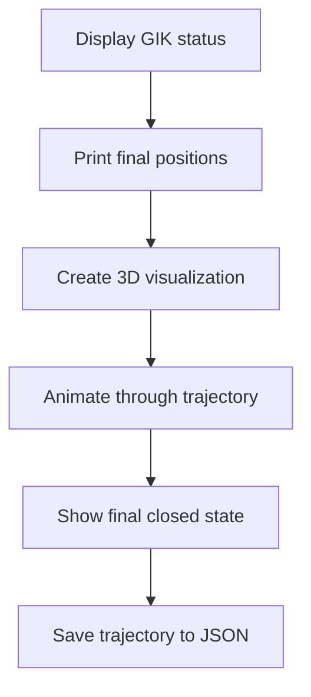

# SimpleGIKprocess_R1BodyAndMug.m - Program Flowchart

## Overview
This MATLAB script implements a three-stage Generalized Inverse Kinematics (GIK) solution for an R1 robot arm to grasp a bottle using the left gripper. The process includes reachability checking, torso adjustment if needed, and a complete grasping sequence.

## Main Program Flow

## Detailed Function Flow

### 1. Initialization Phase

### 2. Environment Setup

### 3. Reachability Check

### 4. Torso Adjustment (if needed)

### 5. solveGraspGIK Function

### 6. Finger Closing Calculation

### 7. Trajectory Generation

### 8. Animation and Output

## Key Variables and Parameters

### Robot Configuration
- **Robot**: R1 v2.1.0 from `fineUrdfs/r1_v2_1_0.urdf`
- **End-effector**: `left_gripper_link`
- **Finger joints**: `left_gripper_finger_joint1`, `left_gripper_finger_joint2`
- **Finger limits**: 0.0 (closed) to 0.05 (open)

### Grasping Parameters
- **Approach offset**: 10cm above grasp pose
- **Table clearance**: 2cm minimum distance
- **Torso adjustment range**: ±0.3 radians for joints 1&2
- **Reachability tolerance**: 15cm for torso adjustment

### Trajectory Parameters
- **Stage 1 (Approach)**: 50 interpolation points
- **Stage 2 (Grasp)**: 50 interpolation points  
- **Stage 3 (Close)**: 30 interpolation points
- **Animation pause**: 0.5 seconds per frame

## Helper Functions

### 1. `solveTorsoToHelpReach()`
- **Purpose**: Solve GIK for torso adjustment
- **Inputs**: Robot, target pose, joint lists, end-effector name
- **Outputs**: Success flag, new torso configuration

### 2. `generateReachabilityWithTorso()`
- **Purpose**: Generate reachability workspace for given torso configuration
- **Inputs**: Robot, torso config, joint list, end-effector name
- **Outputs**: Array of end-effector positions

### 3. `solveGraspGIK()`
- **Purpose**: Main GIK solving function for three-stage grasping
- **Inputs**: Robot, end-effector, grasp pose, constraints, initial guess, joint bounds, bottle diameter
- **Outputs**: Three configurations (approach, grasp, close), trajectory, solution info

## Error Handling

1. **Joint validation**: Checks if defined joints exist in robot model
2. **Reachability**: Tests if target is reachable before proceeding
3. **Torso adjustment**: Handles cases where fixed torso is insufficient
4. **GIK convergence**: Reports best available solution if not fully successful
5. **Finger joints**: Warns if finger joints are not found

## Output Files

- **traj_exmaple.json**: Trajectory data in JSON format
- **Console output**: GIK status, final positions, diagnostic information
- **3D visualization**: Animated robot movement and final state

## Dependencies

### Required Files
- `bottle.mat`: Bottle object with pose and collision geometry
- `table.mat`: Table object with collision geometry
- `fineUrdfs/r1_v2_1_0.urdf`: Robot URDF model
- `updateHomePositionforR1_wholeBody.m`: Robot configuration function

### MATLAB Toolboxes
- Robotics System Toolbox
- Computer Vision Toolbox (for transformations)
- Parallel Computing Toolbox (for parfor loops)

---

*This flowchart documents the complete program flow for the R1 robot arm bottle grasping implementation using Generalized Inverse Kinematics.* 