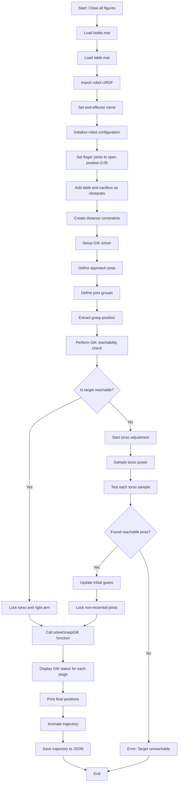

# SimpleGIKprocess_R1BodyAndMug.m - Program Flowchart

## Overview
This MATLAB script implements a robust, modular three-stage Generalized Inverse Kinematics (GIK) solution for the R1 robot arm to grasp a bottle using the left gripper. The process includes left-arm-only reachability checking (torso and right arm locked), cardbox and table collision integration, and a complete grasping sequence.

---

## Key Workflow Updates (2024)
- **Left arm only**: Workspace sampling and GIK are performed with only the left arm joints free; torso and right arm are locked at home.
- **Cardbox integration**: Cardbox is created, visualized, and included in collision constraints alongside the table.
- **No backup/legacy code**: All main scripts and functions are clean and robust; legacy/experimental code is in the `backupFiles-only` branch.

---

## Main Program Flow

---

## Notable Implementation Details
- **Workspace sampling**: Uses `sampleReachableWorkspace` with only left arm joints free.
- **Environment setup**: Both table and cardbox are added as fixed obstacles and included in collision constraints.
- **Automated bottle placement**: If the initial grasp pose is unreachable, the bottle is moved to the closest feasible point.
- **Trajectory and animation**: Three-stage GIK (approach, grasp, close) with full 3D and top-down animation, and trajectory export.
- **Clean codebase**: No references to backup or legacy scripts; all such code is in the `backupFiles-only` branch.

---

## Branch Structure
- **master**: Clean, production-ready codebase
- **feature/robust-grasping-workflow**: Main development branch (recommended for further development)
- **backupFiles-only**: Legacy/experimental scripts and backup files (not used in main workflow)

---

*This flowchart documents the complete, robust program flow for the R1 robot arm bottle grasping implementation using Generalized Inverse Kinematics. For legacy or experimental code, see the `backupFiles-only` branch.* 